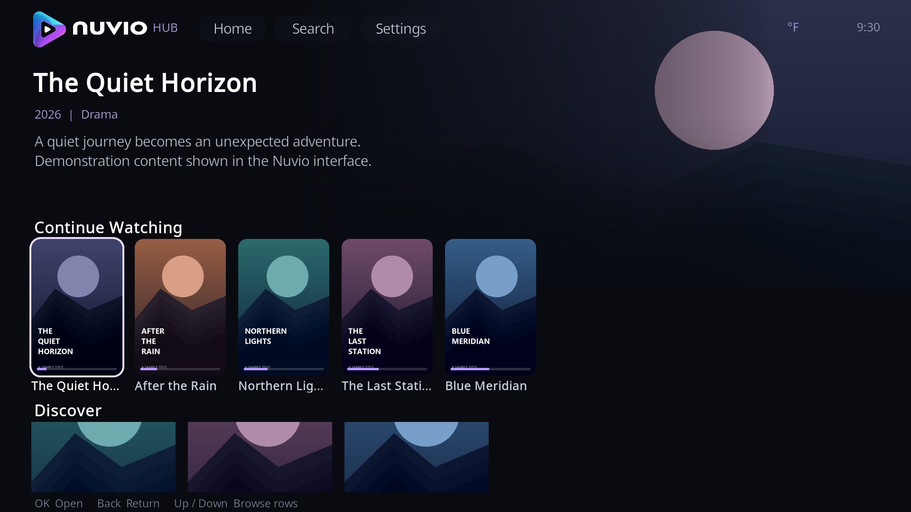

# Nuvio Hub for Kodi — 6.0.7

A community-built Nuvio-style experience inside Kodi: browse collections, explore films and series, and return to what you were watching from a remote-friendly home screen.

**6.0.7 is the first public baseline for this project.** It brings together the Nuvio Hub backend, Nuvio interface, skin and screensaver in one installation package. This is an unofficial community project with a custom Kodi interface. It is not an official Nuvio or Team Kodi release.

## What we have built

- A home screen with poster shelves, collections and Continue Watching.
- Series pages with simple season tabs and Specials placed last.
- Full poster or landscape episode artwork, with a description for each episode.
- Cast and crew portraits, an Info view and More like this recommendations, when supplied by your metadata provider.
- A long-press/context menu for manual stream selection, recommendations and information.
- Watched indicators, saved playback positions and Continue Watching refresh after playback.
- In 6.0.7, the latest locally watched title appears first on the left, before remote-only history. This changes display order without changing saved progress or merge rules.
- Shared settings for accounts, add-ons, collections, playback and subtitles, plus optional IPTV and trailer integration.

[Download 6.0.7](https://github.com/MegaNexusMediaPlayer/Nuvio-Hub/releases/tag/v6.0.7) · [View screenshots](docs/SCREENSHOTS.md) · [Installation](docs/INSTALL.md) · [Contribute](CONTRIBUTING.md) · [6.0.7 release notes](docs/RELEASE-6.0.7.md)

## What you need

For the complete setup documented and supported by this project:

| Requirement | Purpose |
| --- | --- |
| **Kodi 21 / Omega** | Runs the add-on, interface and skin. Local runtime checks used Kodi 21.3. |
| **Nuvio account** | Required for the intended account and add-on synchronization workflow. |
| **AIOStreams or another compatible stream-providing add-on** | Supplies playable sources. You configure your own provider and any accounts it requires. |
| **AIOMetadata** | Mandatory for the intended full metadata experience: title information, artwork, seasons, episodes and available cast data. |
| **Simkl account connected in Nuvio Hub** | Required for the complete Continue Watching and watch-tracking setup described here. |

Some local browsing and resume functions can work without all accounts connected. These requirements describe the project's full setup; they are not a claim that the software blocks every screen without login. Local playback progress is also stored on the device. Metadata completeness and stream availability depend on the providers you configure.

The project does not host films, series or subscription services. Configure sources you are authorized to access. A collection name or service logo does not provide access to that service.

## Install 6.0.7

1. Open the **[Releases](https://github.com/MegaNexusMediaPlayer/Nuvio-Hub/releases/latest)** page and download **`Nuvio-Hub-Complete-6.0.7.zip`**. GitHub's automatic **Source code (zip)** download is for development and is not the Kodi installer.
2. In Kodi, enable **Settings → System → Add-ons → Unknown sources** if required, then use **Add-ons → Install from zip file** and select the downloaded bundle.
3. Open **Nuvio Hub** once to install/update the bundled interface, skin and screensaver. Restart Kodi.
4. Connect your Nuvio and Simkl accounts. Configure AIOMetadata and your stream provider under **Nuvio Settings → Add-ons**.

Updating an existing Nuvio installation: stop playback, close the interface, install the ZIP, open Nuvio Hub once and restart Kodi. Keep your existing add-on data. Back up your profile first if you want a rollback copy. Updates are currently distributed as manual ZIP bundles.

See [the complete installation guide](docs/INSTALL.md) for setup and troubleshooting.

## Help shape the next release

We are opening the project so other people can test it, improve it and help maintain it. Help is especially welcome with Python/Kodi development, skin XML and remote navigation, performance, metadata edge cases, documentation and testing on CoreELEC and other Kodi devices.

Start with an issue or a pull request. Everyone can contribute through a fork; trusted ongoing contributors can be invited as repository collaborators with write access. See [CONTRIBUTING.md](CONTRIBUTING.md).

## Support development

Ko-fi support is optional. Contributions help cover development tools, AI token costs, testing and maintenance. Bug reports, code reviews and documentation are welcome contributions too.

**[Support development on Ko-fi](https://ko-fi.com/master100janovic).** There is no donation requirement to use the project or submit a contribution.

## Testing and current limits

The 6.0.7 baseline received targeted Continue Watching regression checks and local Kodi 21.3/Wine runtime checks. The full regression suite was not repeated for that release. Hardware-specific behavior and live account synchronization still need broader testing; please include your device, OS and Kodi version in reports.

The screenshots use fictional demonstration content. One separate development capture has identifying content and collection artwork blurred. They illustrate the interface, not bundled playable media.

## Credits and licenses

Thanks to NuvioTV, Kodi/Estuary and the upstream projects whose work made this possible. Original copyright notices and license files are retained. Components and assets carry different licenses; this repository does not apply a new blanket license over them. See [LICENSE.md](LICENSE.md) and [THIRD_PARTY_NOTICES.md](THIRD_PARTY_NOTICES.md).
