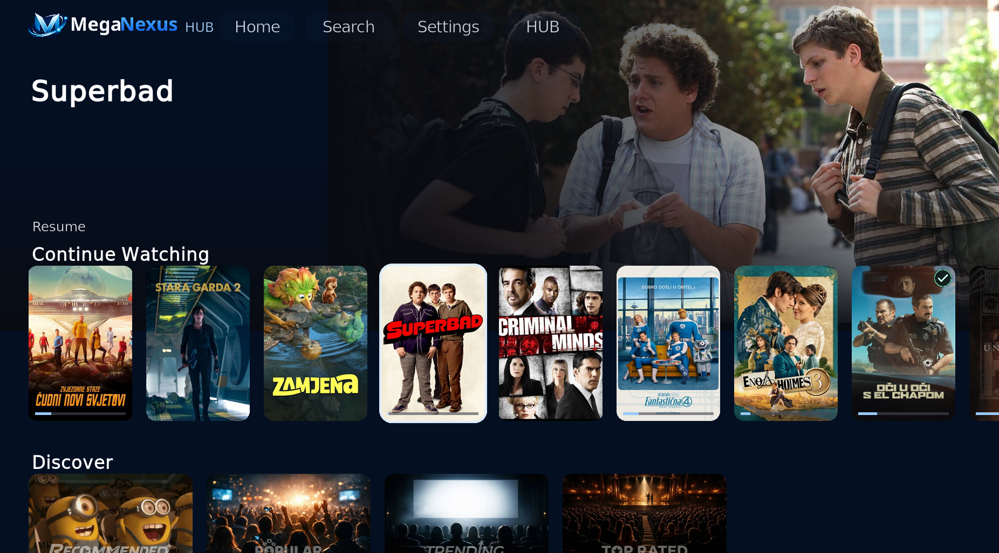
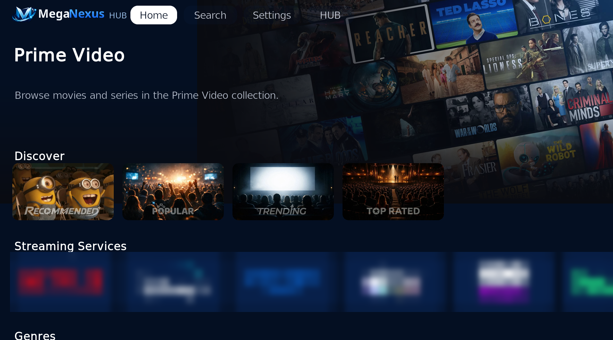
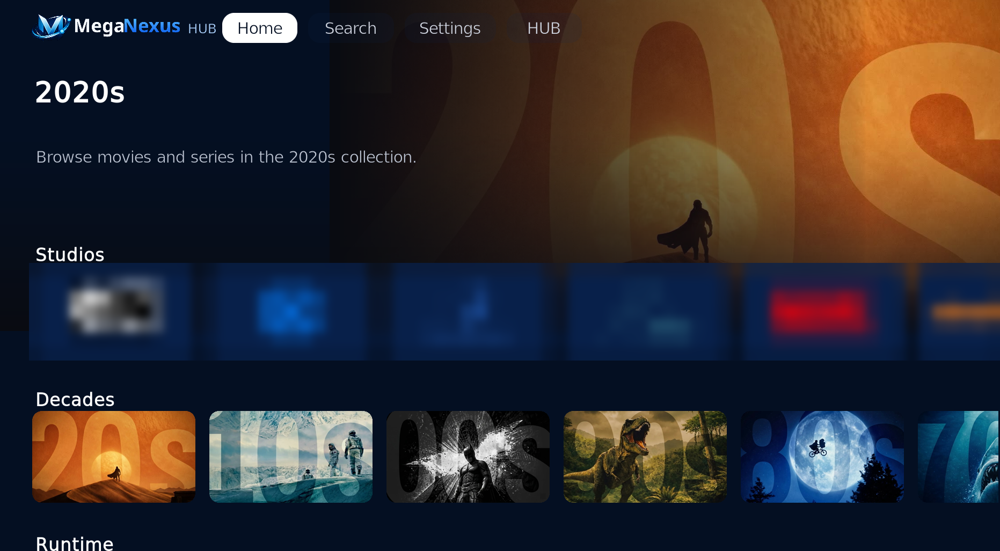
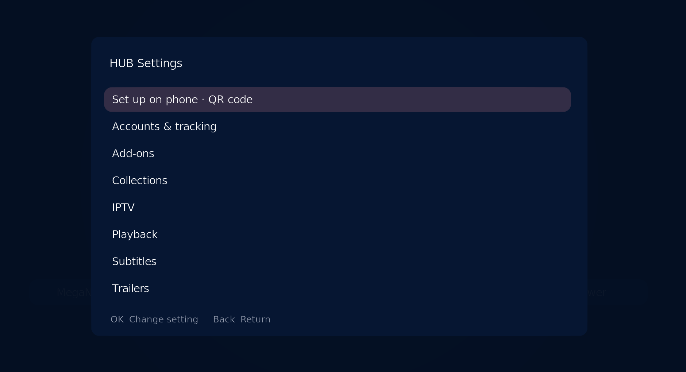
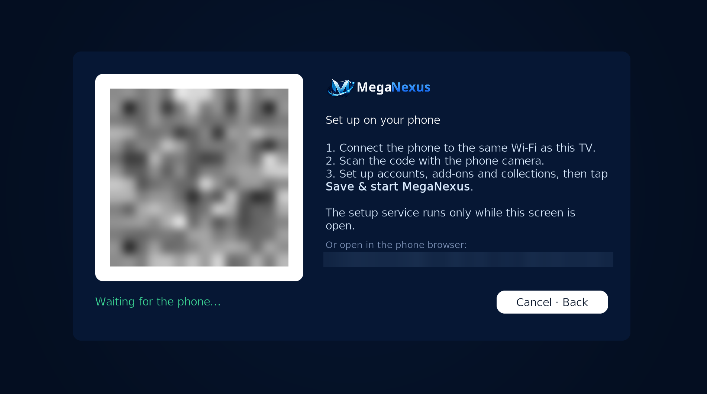
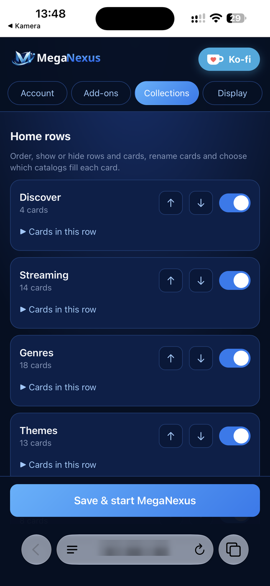
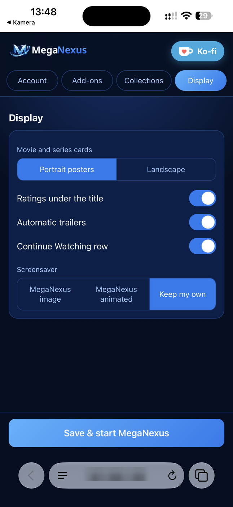
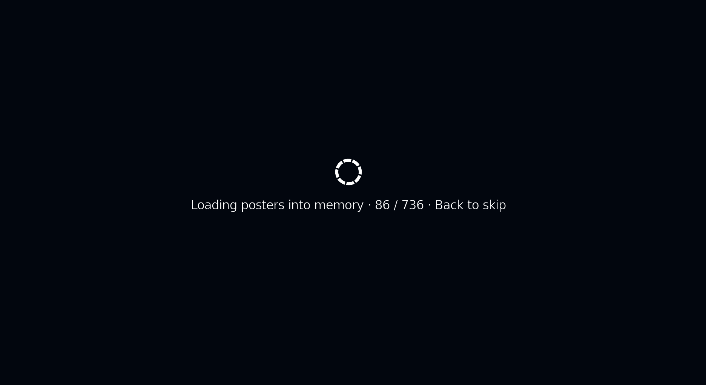

# Screenshots

Captured from MegaNexus 6.0.23 on Kodi and an iPhone. Personal data (account
name and email, private add-on name, local IP address, the one-time QR key)
and trademarked streaming-service and studio logos are blurred. Posters and
stills come from the user's own add-ons and are shown only to illustrate the
interface; MegaNexus does not host or provide any media.

## HUB

## Home

## HUB Settings

## Set up on your phone

The TV shows a QR code; the phone opens the setup page served by Kodi itself on the home network.

| Account | Add-ons | Collections | Display |
|---|---|---|---|
|  |  |  |  |

## First start

