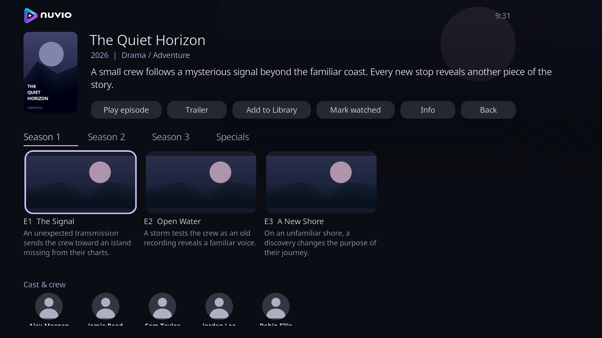
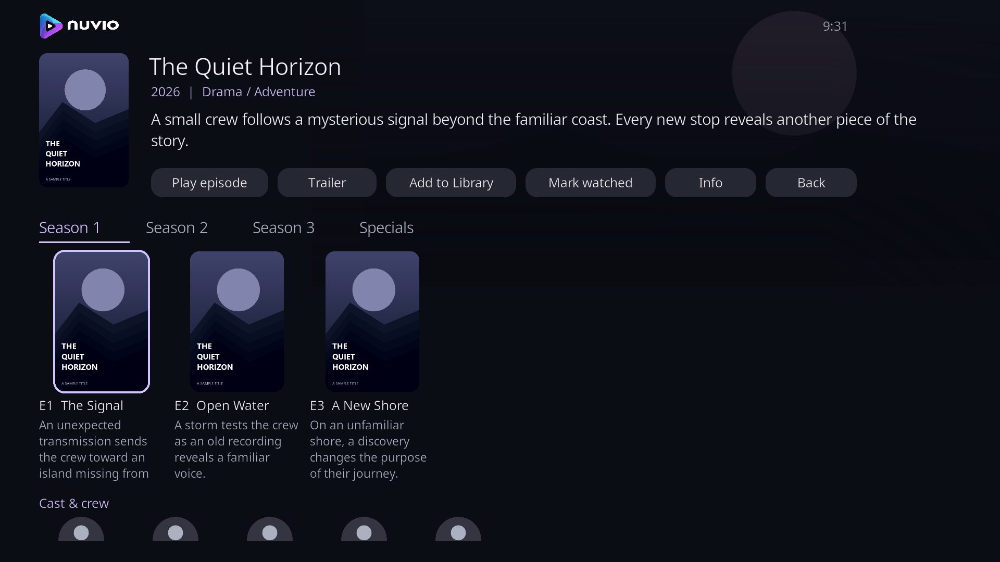
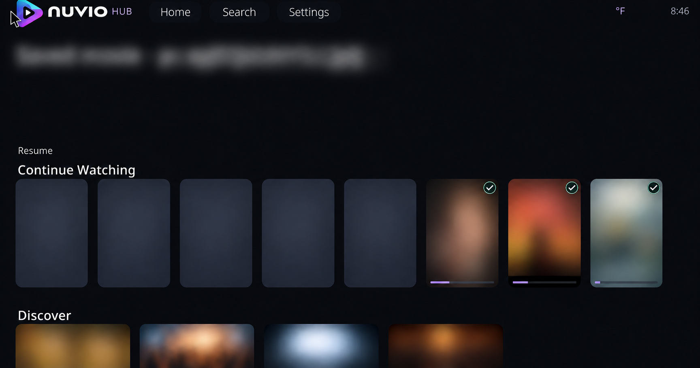
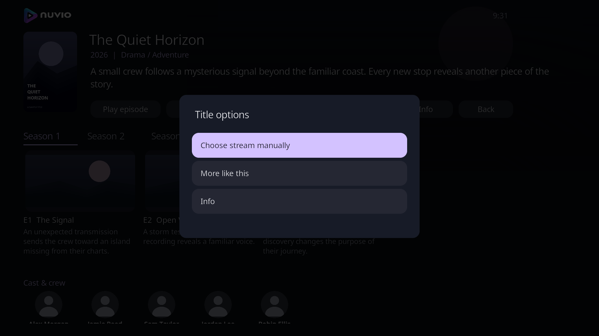

# Screenshots

These four images were captured from the actual 6.0.7 package in an isolated Kodi 21.3/Wine runtime. Titles, artwork and people are fictional demonstration fixtures. They show the interface and do not represent included playable content or live account synchronization.

## Home and collections

## Landscape episodes

## Poster episodes

## Redacted development capture

The following is an earlier user-supplied development capture edited with the built-in image generation tool to obscure title/identifier text, posters and collection artwork. It is an illustrative redacted image, not a pixel-exact capture or evidence of final 6.0.7 ordering. The demo captures are preferred for the public release.

## Long-press title options

